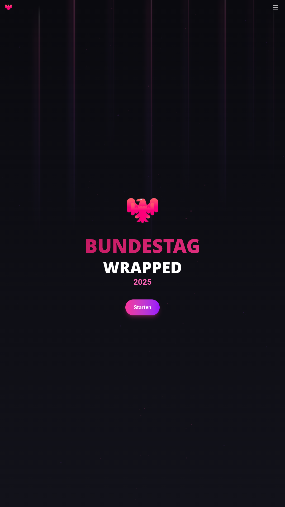
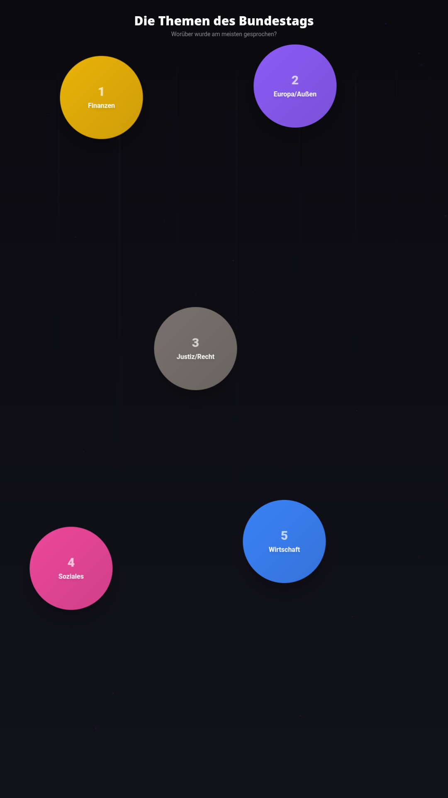
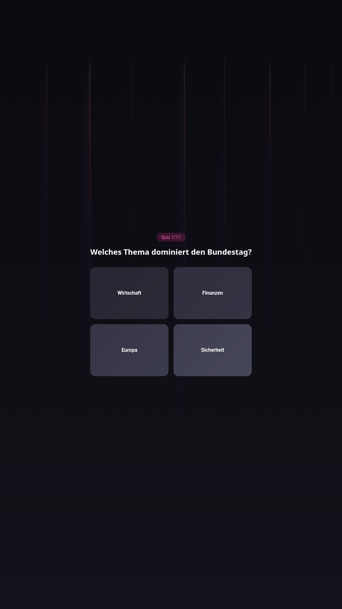
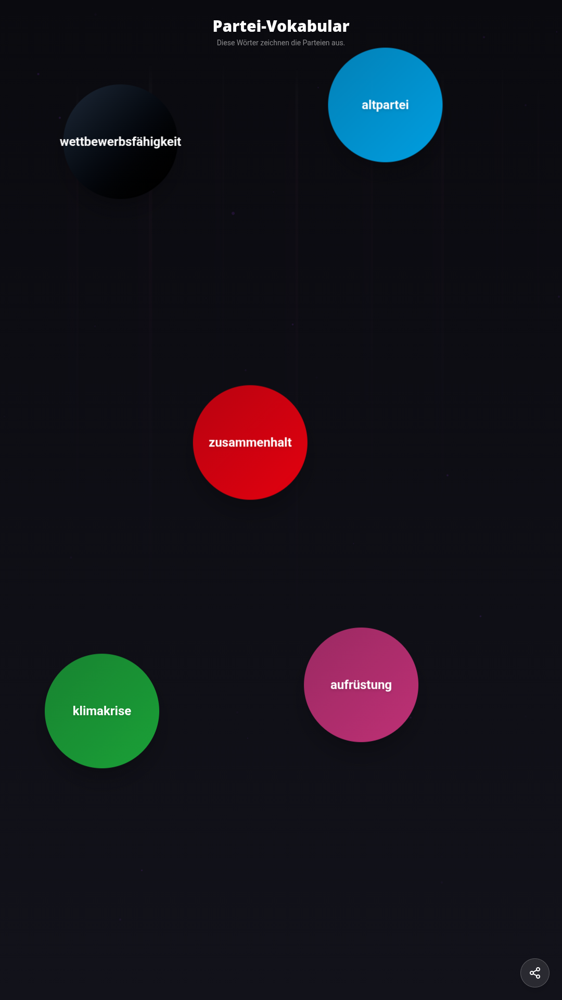
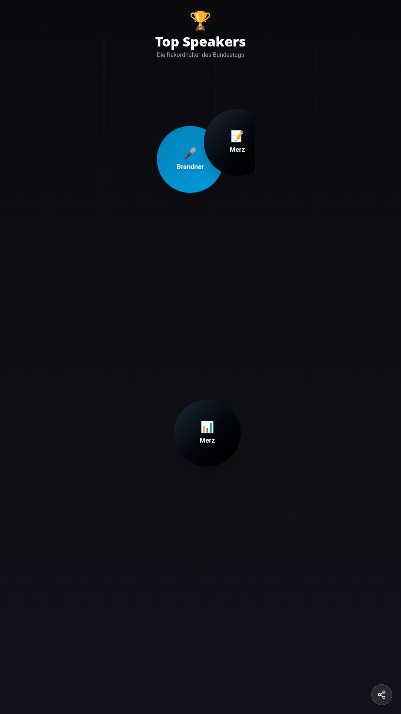

<div align="center">


# Bundestag Wrapped — Web & Mobile

**Spotify Wrapped, but for the German _Bundestag_.**
The flagship front-end of the [Bundestag Wrapped](../../README.md) monorepo.

[](https://bundestag-wrapped.de)
[](../../LICENSE)

</div>

> Part of the **[Bundestag Wrapped](../../README.md)** monorepo · siblings: [`services/analysis`](../../services/analysis/README.md) (data) · [`services/mcp`](../../services/mcp/README.md) (AI/MCP API)

A Spotify-Wrapped-style visualization of German Bundestag speeches — a swipeable, animated
year-in-review of parliament. Built as a **React web app** and a **native mobile app**, both
rendering pre-computed JSON (no backend at runtime).

## What you get

<div align="center">







</div>

- **Animated story cards** — top topics, record-holders, signature vocabulary, and the tone of debate.
- **Interactive quiz** — guess the numbers before the reveal.
- **Shareable sharepics** — each card renders to an image (canvas) for social media.
- **700+ speaker profiles**, **full speech search**, and **statistics pages** (coalition vs.
  opposition, who-interrupts-whom, cross-party comparisons).
- **Sound & motion** for a polished, Spotify-grade feel.

## Quick Start

```bash
# from the monorepo root
pnpm install
pnpm dev:web            # → http://localhost:5173

# mobile (Expo)
pnpm --filter bundestag-wrapped-mobile start
```

## Project Structure

```
├── src/                    # Web app (React 19 + Vite 7)
│   ├── components/slides/  # The animated "story" cards
│   ├── lib/share-canvas.ts # Sharepic (canvas) generation
│   └── ...
├── mobile/                 # Native app (Expo SDK 54 + React Native 0.81)
├── public/                 # Static JSON data + icons + og-image
├── screenshots/            # Store/README screenshots
└── Dockerfile              # Static production build (nginx)
```

## Tech Stack

| Web | Mobile |
|-----|--------|
| React 19, Vite 7 | Expo SDK 54, React Native 0.81 |
| TailwindCSS 4 | NativeWind |
| Motion (animation) | Moti + Reanimated |
| React Router 7 | Expo Router 6 |
| Zustand · TanStack Query · Howler (audio) | Skia · View Shot (sharepics) |

## Data

Static JSON in `public/`, generated by the [`services/analysis`](../../services/analysis/README.md)
Python pipeline (no runtime backend):

| File | Description |
|------|-------------|
| `wrapped.json` | Party stats, tone analysis, quizzes |
| `speakers/*.json` | 700+ individual speaker profiles |
| `speeches_db.json` | Full searchable speech database |

## Deployment

```bash
# Docker (static site via nginx, serves on :8080)
docker build -t bundestag-wrapped . && docker run -p 8080:8080 bundestag-wrapped

# Static hosting
pnpm --filter bundestag-wrapped build   # deploy dist/

# Mobile (EAS)
cd mobile && eas build --platform android --profile production
```

## License

[GNU AGPL-3.0](../../LICENSE) © 2026 Moritz Wächter
